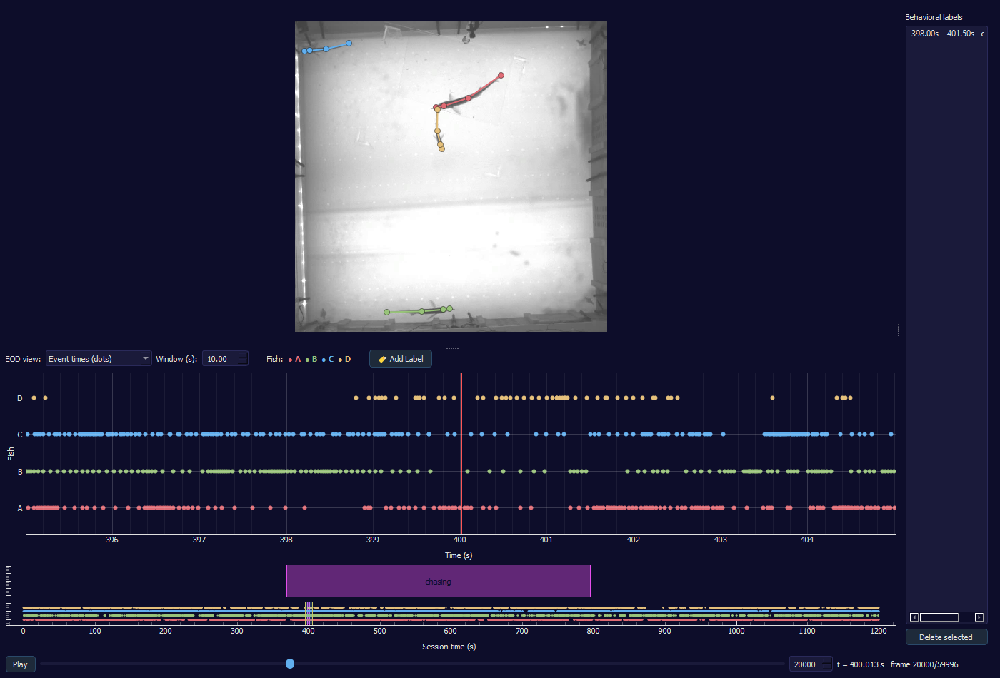

# Fish EOD/Video Viewer

A PyQt5 desktop tool for inspecting electric-fish tank recordings: it plays the
tank video with each fish's tracked skeleton overlaid, and shows a synced
timeline of every detected EOD (electric organ discharge) pulse, split out
per fish identity. Built for checking EOD-to-fish assignment quality and for
adding behavioral labels to a recording session.



## What it does

- **Video + pose overlay** — plays/scrubs the tank video with each fish's
  tracked keypoints (mouth, head, middle, tail) drawn in a per-fish color.
- **Per-fish EOD timeline** — a scrolling window around the current video
  frame's time, either as an event raster (one row per fish) or as each
  fish's own instantaneous discharge frequency (1 / inter-pulse-interval).
  A red marker line shows exactly where the video currently is, since video
  (frame-indexed) and EOD pulses (event-timestamped) run on different
  clocks.
- **Assignment QC** — flags pulses whose implied discharge rate exceeds a
  configurable biological plausibility threshold (default 170 Hz) with a
  marker, since these usually indicate an EOD-to-fish assignment error.
- **Behavioral labeling** — drag-select a stretch of the timeline to tag it
  with a free-text label (reusing or creating labels via a dropdown).
  Labels are color-coded, shown on the timeline and a full-session overview,
  listed in a side panel for quick navigation, and auto-saved next to the
  data file so nothing is lost between sessions.

## Installation

Requires Python 3.10+.

### Using conda (recommended — handles PyQt5 more reliably across platforms)

```bash
conda create -n fish-viewer python=3.11 -y
conda activate fish-viewer
pip install -r requirements.txt
```

### Using venv

```bash
python3 -m venv .venv
source .venv/bin/activate   # Windows: .venv\Scripts\activate
pip install -r requirements.txt
```

This installs `numpy`, `pandas`, `PyQt5`, `pyqtgraph`, and
`opencv-python-headless` — all pure cross-platform packages (Windows,
macOS, Linux).

## Running it

```bash
python view_ground_truth.py VIDEO_PATH CSV_PATH
```

- `VIDEO_PATH` — the tank recording (`.avi`/`.mp4`)
- `CSV_PATH` — the matching identity-labelled `Data_4fish_..._no_ref_per.csv`

Example:

```bash
python view_ground_truth.py "/path/to/video2024-02-20T21_16_26.avi" \
                             "/path/to/Data_4fish_2024-02-20T21_16_26_no_ref_per.csv"
```

> On a shared drive (Google Drive, etc.), the mount path differs by OS and
> by machine — just point the two arguments at wherever the files actually
> sit on your computer.

## Expected CSV format

One row per detected EOD pulse, with these columns:

| Column | Description |
|---|---|
| `Frame` | Video frame the pulse falls in (1-indexed) |
| `RelativeTime` | Pulse timestamp in seconds, relative to the video |
| `discharging_fish` | Ground-truth fish identity for this pulse: `A`, `B`, `C`, or `D` |
| `{bodypart}_x_{fish}`, `{bodypart}_y_{fish}`, `{bodypart}_score_{fish}` | Pose for `bodypart` in `{mouth, head, middle, tail}` and `fish` in `{A, B, C, D}`, held constant across all pulses of the same video frame |

(`chin` is intentionally not used — it's a small keypoint with high tracking
error, so it's excluded from both identity assignment and the skeleton
overlay.)

Frames with no detected pulse have no row; the viewer displays such a
frame's pose using the nearest frame that does have one.

## Controls

- **Play / Pause**, frame slider, frame spinbox — video navigation.
- **EOD view** — switch between "Event times (dots)" and "Instantaneous
  frequency".
- **Window (s)** — width of the scrolling EOD timeline around the current
  frame.
- **Lock Y range (Hz)** — pin the frequency plot's Y axis instead of
  auto-scaling to the 99th percentile each redraw.
- **Max plausible (Hz)** — discharge-rate threshold above which a pulse is
  flagged as a likely assignment error (✕ marker + dashed reference line).
- **🏷 Add Label** — toggle on, then drag a range on the EOD timeline to tag
  it. Pick an existing label or type a new one. Labels are listed on the
  right (double-click to jump to one, or delete it) and auto-saved to
  `<csv_basename>_annotations.csv` next to the CSV.
- Drag the region on the full-session overview strip (bottom) to jump the
  video anywhere in the recording.
